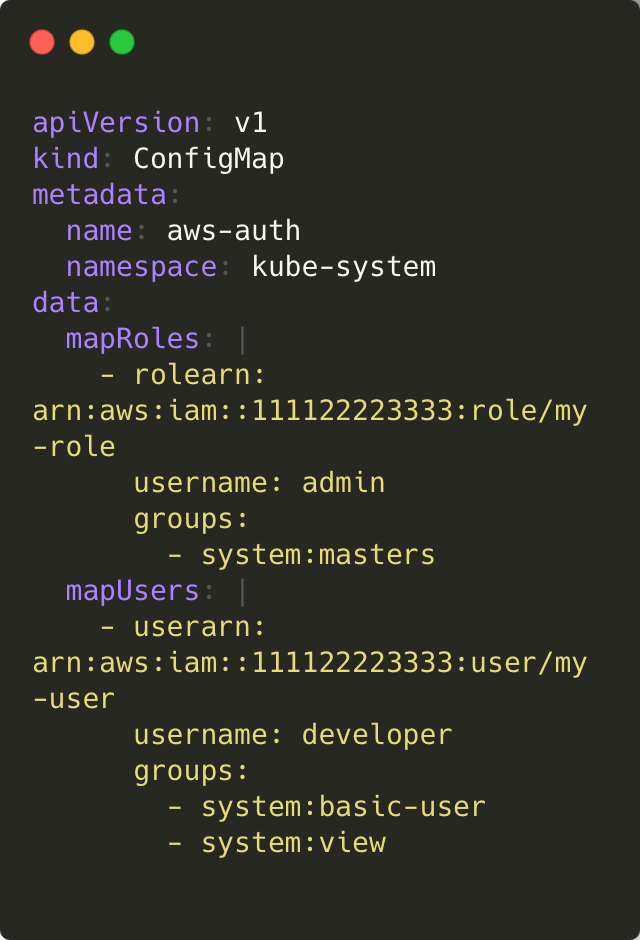

## 1.  일반적인 Kubernetes 와 EKS 의 kubeconfig 파일 차이점


기본적인 kubeconfig 파일은 보통 아래와 같은 요소를 포함합니다
```
apiVersion: v1
kind: Config
clusters:
- name: my-cluster
  cluster:
    server: https://my-cluster-api-server
    certificate-authority-data: BASE64_ENCODED_CA
users:
- name: my-user
  user:
    client-certificate-data: BASE64_ENCODED_CERT
    client-key-data: BASE64_ENCODED_KEY
contexts:
- name: my-context
  context:
    cluster: my-cluster
    user: my-user
current-context: my-context
```


일반적인 Kubernetes 와 EKS 의 kube config의 주요 차이점으로는 아래와 같습니다.


API 엔드포인트: EKS는 관리형 Kubernetes 클러스터이므로, API 서버 엔드포인트가 AWS에서 제공됩니다.
IAM 기반 인증: kubeconfig에서 직접 토큰을 저장하는 것이 아니라 aws eks get-token 명령어를 통해 동적으로 인증을 수행합니다.
CA 인증서 포함: AWS 제공 인증서가 포함되어 있으며, 자체적으로 변경이 어렵습니다. 즉, 일반 Kubernetes에서는 직접 관리하는 CA 및 인증서를 사용하지만, EKS에서는 IAM 기반 인증을 사용하여 자동으로 토큰을 가져옵니다.


| 항목        | 일반 Kubernetes      | EKS                   |
|------------|--------------------|----------------------|
| 인증 방식   | x509 인증서         | IAM을 통한 인증       |
| API 엔드포인트 | 직접 설정           | AWS가 제공            |
| kubeconfig 내 토큰 | 직접 포함 가능   | `aws eks get-token` 사용 |


## 2. EKS Authentication & Authorization

### 2.1 Role Based Access Control (RBAC)

EKS의 인증과 인가는 IAM과 Kubernetes RBAC(Role-Based Access Control)를 조합하여 이루어집니다.
Role-Based Access Control (RBAC)은 사용자, 그룹 또는 서비스 계정(SA)에 클러스터 내의 리소스에 대한 접근을 제어하는 방법입니다.


**인증 (Authentication)**

aws eks get-token 명령을 사용하여 AWS IAM을 통해 인증 토큰을 생성합니다.
AWS IAM을 통해 aws-auth ConfigMap에 등록된 사용자인지 확인합니다.
IAM 역할과 사용자 정책에 따라 API 서버 접근이 허용됩니다.


**인가 (Authorization)**

aws-auth ConfigMap을 통해 IAM 역할과 Kubernetes RBAC를 연결합니다.
RBAC(Role-Based Access Control)를 활용하여 권한을 설정합니다.
예를 들어, 특정 IAM 사용자가 클러스터의 admin 또는 readonly 권한을 갖도록 설정할 수 있습니다.


### 2.2 다른 사용자에게 클러스터 접근 권한 부여하기

EKS 클러스터에 다른 사용자를 추가하려면 aws-auth ConfigMap을 수정해야 합니다.


- mapRoles: IAM 역할을 Kubernetes 그룹과 연결합니다.
- mapUsers: 특정 IAM 사용자를 Kubernetes 사용자로 매핑합니다.
- groups: RBAC를 사용하여 사용자에게 특정 권한을 부여할 수 있습니다.

이렇게 설정하면, 해당 IAM 사용자 또는 역할을 가진 계정이 kubectl을 통해 클러스터에 접근할 수 있습니다.

혹은 eksctl 을 사용할경우 아래와 같은 명령어를 통해 진행 할 수 있습니다.


```eksctl
eksctl create iamidentitymapping --cluster my-cluster --region=region-code \
    --arn arn:aws:iam::111122223333:role/my-role --username admin --group binding-name \
    --no-duplicate-arns
```

https://docs.aws.amazon.com/ko_kr/eks/latest/userguide/auth-configmap.html


## 3. Pod는 배포 시 어디로 가나요?
Pod가 배포될 때, Kubernetes의 스케줄러가 해당 Pod를 어느 노드(Node)에 배치할지를 결정합니다. 기본적으로 Kubernetes는 여러 요소를 고려하여 최적의 노드를 선택합니다.

```yaml
apiVersion: v1
kind: Pod
metadata:
  name: nginx
  labels:
    app: nginx
spec:
  containers:
  - name: nginx
    image: nginx
    ports:
    - containerPort: 80
```

다음과 같이 Nginx Pod 를 생성 할 경우, Kubernetes 스케줄러가 적절한 노드를 찾아서 배치합니다. 기본적으로 CPU 및 메모리 사용량을 고려하여 여유 있는 노드에 배치되며,
만약 특정 노드에 파드들을 배치하기 위해선 아래의 방법들이 있습니다.


1. nodeSelector

nodeSelector 의 경우 특정 레이블을 가진 노드에만 Pod를 배치하도록 합니다. 파드 스펙에 nodeSelector 필드를 추가하고 타겟으로 삼고싶은 노드가 갖고 있는 노드 레이블을 명시 해주면, 해당 레이블을 갖고 있는 노드에만 파드를 스케줄링합니다.
만약 명시된 레이블을 가지고 있는 노드가 존재하지 않을 경우, 배포할 노드가 존재하지 않기에 pending 상태가 됩니다.

📌 example
```yaml
spec:
  nodeSelector:
    label-key: value
 ```
2. nodeAffinity

nodeAffinity는 nodeSelector보다 더 유연한 방식으로, 여러 조건을 조합하여 원하는 노드에 Pod를 배포할 수 있도록 합니다.
nodeAffinity에는 다음 두 종류가 있습니다.

- requiredDuringSchedulingIgnoredDuringExecution: 규칙이 만족되지 않으면 스케줄러가 파드를 스케줄링할 수 없습니다. 이 기능은 nodeSelector와 유사하지만, 좀 더 표현적인 문법을 제공 합니다.
- preferredDuringSchedulingIgnoredDuringExecution: 스케줄러는 조건을 만족하는 노드를 찾으려고 노력합니다. 해당되는 노드가 없더라도, 스케줄러는 여전히 파드를 스케줄링한다.

아래 예시에서는 requiredDuringSchedulingIgnoredDuringExecution을 사용하여 **파드가 반드시 특정 조건을 만족하는 노드에서만 실행되도록 강제 합니다.**

📌 example


이외에도 NodeAffinty 의 반대로 노드가 파드 및 파드그룹을 제외시키는  **Taints & Tolerations**, 지역(region), 존(zone), 노드 및 기타 사용자 정의 토폴로지 도메인과 같이 장애 도메인으로 설정된 클러스터에 걸쳐 파드가 분배되는 방식을 제어할 수 있는 **PodTopologySpreadConstraints** 가 있습니다.

### 3.1 배포 방법 종류

Kubernetes에는 다양한 배포 방식이 있습니다.

-	**Pod (단일 배포)**: 가장 기본적인 형태의 배포방식으로, 특정한 하나의 파드를 배포할때 사용하며, 테스트용으로 단일 컨테이너 배포시에 사용됩니다

-	**Deployment**: 여러 개의 Pod를 관리하고 업데이트를 쉽게 수행할 수 있으며, 웹, API서버 등의 가용성을 보장해야할때 사용됩니다.

-	**DaemonSet**: 각 노드마다 하나의 Pod를 강제로 배치할 때 사용되며, 로그 수집기, 모니터링 에이전트등을 모든 노드에 배포할때 사용됩니다.
-	**StatefulSet**: 상태를 유지해야 하는 애플리케이션(예: 데이터베이스)을 배포할 때 사용되며, MYSQL, Kafka 등 상태가 중요한 애플리케이션을 배포할때 사용됩니다.
-	**Job / CronJob**: 특정 작업을 1회 또는 일정한 간격으로 수행할 때. 사용되며, Job의 경우 데이터마이그레이션 일회성 작업을 수행할때 사용되며, Cronjob 의 경우 정기적인 작업을 수행할때 사용됩니다.


## 4. EKS 구성

### 4.1 콘솔에서 EKS 구성
1. 클러스터 구성


2. 노드그룹 구성


### 4.2 EKSCTL 활용하여, EKS 구성
> eksctl 및 aws cli 설정이 되어있다는 전제하에 진행 하겠습니다.
1. Cluster Config 파일 작성
    </br></br>
    해당 파일에서 지정하지 않은 옵션은 Eksctl 기본 값으로 구성되게 됩니다. 기본 값의 경우 아래 링크를 참고하여 ClusterConfig 파일을 작성합니다.
    <br></br>
    아래 구성의 경우 노드 그룹 하나를 구성하며, 해당 노드그룹은 t3.medium 패밀리로 인스턴스들을 생성합니다. 생성 개수는 최대 2개 최소 1개이며, 원하는값은 1개로 설정하여 구성시 EC2 인스턴스 하나가 실행중인 상태 로 구성합니다.
    </br></br>
    📌 cluster.yaml
    
2. 아래 명령어를 통해 실행
    

### 4.3 Eksctl vs Console made

eksctl 의 경우 일반적으로 생성하는 eks 와 달리 kubeconfig 를 자동으로 생성 및 수정 해주며, 따로 등록 할 필요가 없습니다.
추가적으로 콘솔에서는 GUI 를 설치 할 수 있으며, EKSCTL 의 경우 CLI 를 통해서만 설치 할 수 있는점,
EKSCTL에서는 Config 파일을 통해 생성해놓은 클러스터의 정보를 저장하거나 추후 동일한 클러스터를 사용할때 용이하지만, 콘솔은 불가능 한점,
마지막으로 콘솔에서는 기타 다른 서비스를 통해 설치되는것이 아닌, 직접 AWS API 를 통해 생성하지만, EKSCTL 은 CloudFomation 을 통해 설치하는 점 이 있습니다.
