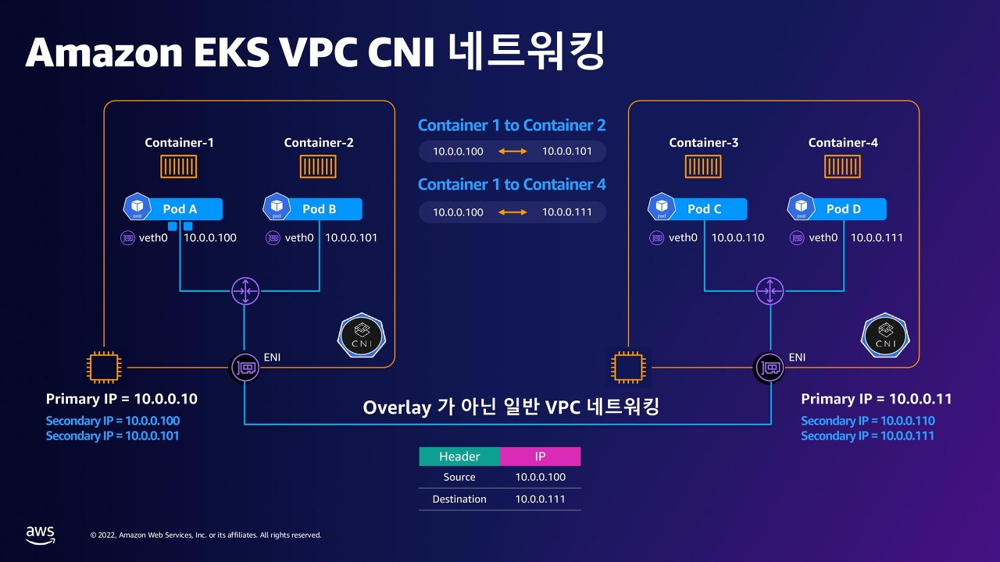
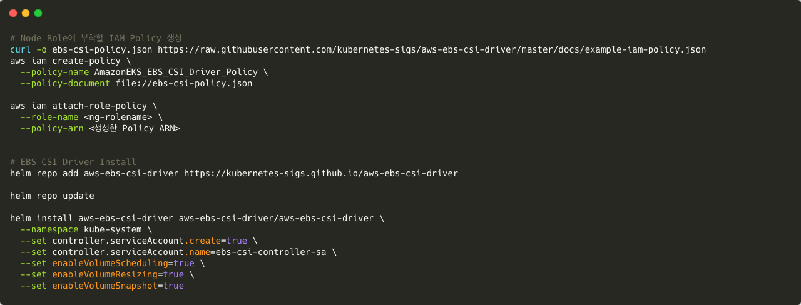

## ✅ Kubernetes에서 Pod 스케일링이 필요한 이유

Kubernetes에서 애플리케이션을 안정적이고 효율적으로 운영하려면 **Pod 스케일링**이 필수적입니다.  
트래픽이 증가하면 더 많은 리소스를 할당해 성능을 유지하고, 사용량이 줄면 자원을 줄여 낭비를 막아야 하죠.  
이렇게 동적으로 자원을 조절하는 과정을 스케일링이라고 하며, Kubernetes는 이를 자동으로 처리할 수 있는 다양한 메커니즘을 제공합니다.

스케일링은 크게 두 가지 방식으로 나뉩니다.  
**수평 스케일링(Horizontal Scaling)**은 Pod의 개수를 늘리거나 줄이는 방식이고,  
**수직 스케일링(Vertical Scaling)**은 하나의 Pod에 할당된 CPU나 메모리 등의 리소스를 증감하는 방식입니다.

수평 스케일링은 일반적으로 `Deployment`, `StatefulSet`처럼 복제 가능한 워크로드에 적합하며,  
`DaemonSet`처럼 Pod 수를 늘리기 어려운 경우에는 수직 스케일링이 사용됩니다.  
예를 들어 로그 수집기처럼 노드마다 1개만 존재해야 하는 경우가 이에 해당합니다.

--- 

## 🔄 스케일링의 종류

### 1. 수평 스케일링 (Horizontal Scaling)
- Pod 개수를 조절하여 확장
- 주로 Deployment, StatefulSet에서 사용
- HPA(Horizontal Pod Autoscaler)로 자동화 가능
- 메트릭 기반 (CPU, 메모리, 커스텀)

### 2. 수직 스케일링 (Vertical Scaling)
- Pod 하나의 리소스(CPU/Memory) 조절
- DaemonSet 등 Pod 수 조절이 어려운 경우 사용

---

## HPA를 활용한 자동 스케일링

수평 스케일링은 보통 **HPA(Horizontal Pod Autoscaler)**를 통해 구현합니다.  
HPA는 CPU, 메모리, 혹은 사용자 정의 지표(Custom Metrics)를 기반으로 설정된 조건에 따라 자동으로 Pod 수를 조정합니다.  
이를 위해선 `Metrics Server` 같은 메트릭 수집 도구가 클러스터에 설치되어 있어야 합니다.

HPA는 주기적으로 메트릭을 수집하고, 스케일 조건에 맞게 워크로드의 replica 수를 조정합니다.  
이때 실패한 Pod나 종료 중인 Pod는 제외되며, Ready 상태인 Pod만을 기준으로 판단합니다.  
또한 초기화 중인 Pod는 일정 시간 동안 스케일 판단 대상에서 제외되며,  
이를 위한 설정 값으로는 다음이 있습니다:

- `--horizontal-pod-autoscaler-initial-readiness-delay` (기본 30초)  
- `--horizontal-pod-autoscaler-cpu-initialization-period` (기본 5분)

HPA는 메트릭이 누락되거나 준비되지 않은 Pod가 있으면 보수적으로 판단합니다.  
예를 들어 확장(Scale Out) 시에는 해당 Pod를 0% 사용한 것으로 간주해 확장을 억제하고,  
축소(Scale In) 시에는 100% 사용 중인 것으로 간주해 축소를 억제합니다.  
이는 불필요하거나 과도한 스케일링으로 인한 시스템 불안정을 방지하기 위함입니다.

---

## ⚠️ 스케일링 시 유의사항

- DaemonSet은 수평 스케일 불가 → 수직 스케일로 대응
- HPA는 Metrics Server 미설치 시 작동 불가
- 다음 Pod는 스케일 판단 제외됨:
  - 삭제 중(Pod deletionTimestamp 존재)
  - 실패한 Pod
  - Ready 상태가 아닌 Pod

---

## 스케일링을 반드시 구성해야 할까?

반드시 필수는 아니지만, **트래픽이 유동적이거나 예상치 못한 부하가 자주 발생하는 서비스라면 구성하는 것이 매우 권장됩니다.**  
스케일링 설정을 잘 해두면 성능을 안정적으로 유지하면서도 리소스를 낭비하지 않고,  
필요할 때 빠르게 확장해 장애를 방지할 수 있습니다.

다만 모든 리소스가 수평 스케일링이 가능한 건 아닙니다.  
예를 들어 `DaemonSet`은 노드당 하나만 생성되므로 Pod 수를 늘릴 수 없고,  
수직 스케일링처럼 리소스를 직접 조정하는 방식이 필요합니다.

---

## 🌐 Pod 네트워크 통신

Kubernetes 환경에서의 Pod 통신은 기본적으로 같은 네임스페이스 내에서는 **Pod IP 또는 서비스 이름**을 통해 이뤄지며,  
다른 네임스페이스의 Pod와 통신할 경우에는 `service-name.namespace.svc.cluster.local` 형식을 사용할 수 있습니다.
쿠버네티스는 PQDN 과 FQDN 을 지원하여 유동적으로 변경되는 프라이빗 아이피에 대해 도메인으로써 위와같이 요청을 할 수 있습니다.
이를 통해 서비스 명을 활용하여 IP 를 입력하지 않고도 동일한 요청을 할 수 있습니다.

일반적인 Kubernetes에서는 CNI 플러그인이 오버레이 네트워크를 생성하여 Pod 간 통신을 가상 네트워크로 처리합니다.
예를 들어 Calico, Flannel 같은 CNI는 IP-in-IP나 VXLAN을 사용해 Pod 네트워크를 구성합니다.

하지만 EKS에서 사용되는 AWS VPC CNI는 이런 오버레이를 사용하지 않고, 물리적인 VPC 네트워크를 그대로 사용합니다.

이 플러그인은 각 Pod에 VPC의 실제 IP 주소(Secondary IP)를 할당합니다. 덕분에 Pod들은 서로 직접 IP 기반으로 통신할 수 있습니다.

즉, 파드간 통신의 경우 Kubernetes의 논리적 네트워크가 아니라, AWS의 물리적 VPC 네트워크 상에서 **L3 통신(라우팅)**이 이뤄지는 구조입니다.

1️⃣ 동일 노드 내 Pod 간 통신
	- Pod 간 통신은 veth pair → Linux bridge를 통해 로컬에서 처리됩니다.

2️⃣ 서로 다른 노드의 Pod 간 통신
	- 트래픽은 송신 Pod의 Secondary IP → ENI → VPC 라우팅 → 대상 ENI → 대상 Pod 흐름으로 이동합니다.
	- 이때 사용되는 IP는 모두 실제 VPC 내부 IP이기 때문에 라우팅은 AWS의 물리적 네트워크 인프라를 통해 처리됩니다.

📦 결과적으로, Pod 간 통신은 L2 수준의 브리지 통신(같은 노드) 또는
**L3 수준의 VPC 라우팅(다른 노드)**으로 나뉘게 됩니다.

이를통해
	- VPC 내에서 Pod들은 마치 EC2 인스턴스처럼 직접 통신할 수 있습니다.
	- IP 충돌 걱정 없이 보안 그룹, VPC 라우팅 테이블, NACL 등 AWS 인프라 제어 가능
	- AWS Load Balancer와의 연동도 자연스럽고, EKS 서비스와의 통합성이 뛰어납니다.

## 🌐 Ingress Controller란?

외부에서 클러스터 내부 서비스에 접근하려면 **Ingress Controller**를 사용합니다.  
Ingress는 HTTP/HTTPS 트래픽을 받아 내부 서비스로 라우팅하는 역할을 하며,  
이를 실제로 처리하는 Ingress Controller로는 NGINX, AWS ALB Controller 등이 있습니다.
이를 구성하는 방법은 뒤에서 알아보도록 하겠습니다.

- 예: NGINX Ingress Controller, AWS ALB Controller 등

---

## 💊 Pod 헬스체크 구성

다음으로 Kubernetes는 서비스의 안정성을 높이기 위해 **헬스체크(Probe)** 기능을 제공합니다.  
`livenessProbe`, `readinessProbe`, `startupProbe`를 통해 컨테이너가 살아있는지, 요청을 받을 준비가 되었는지,  
초기 구동에 성공했는지를 확인합니다.  

- `livenessProbe`: 실패 시 컨테이너 재시작  
- `readinessProbe`: 실패 시 트래픽에서 제외  
- `startupProbe`: 느린 앱 초기화 대응용

startupProbe는 애플리케이션이 “시작 중”일 때는 기다려주고,
정상 기동되지 못할 경우 강제로 재시작시키는 데 사용되는 Probe입니다.

기존에는 livenessProbe만 있으면 부팅 중인 애플리케이션도
“살아있지 않다”고 판단하고 재시작해버리는 문제가 있었습니다.

→ **readiness 실패 시** 트래픽 차단, **liveness 실패 시** 재시작

하지만 일부 앱은 초기화에 몇 분이 걸릴 수 있기에.
이런 경우 startupProbe를 설정하면 시작 중에는 livenessProbe를 무시하고
정해진 시간 안에만 살아나면 OK로 간주합니다.

**readinessProbe**가 실패하면 해당 Pod는 서비스 엔드포인트에서 제외되므로 트래픽을 받지 않고,  
**livenessProbe**가 실패하면 재시작 전까지는 트래픽을 받을 수 있습니다.

---

## 💾 Kubernetes Storage 

### 관련 리소스

- **PersistentVolume (PV)**: 클러스터에서 제공되는 실제 저장소
- **PersistentVolumeClaim (PVC)**: Pod가 요청하는 저장소
- **StorageClass**: 스토리지 성능, 접근 방식, 동적 프로비저닝 정책을 정의
#### StorageClass란?

- PVC 생성 시 어떤 스토리지 종류/성능을 사용할지 지정
- 동적으로 PV를 생성하며, 다양한 접근 모드 및 리소스 옵션 제공

---
## 📦 Deployment vs StatefulSet

| 항목             | Deployment (Stateless)        | StatefulSet (Stateful)                        |
|------------------|-------------------------------|-----------------------------------------------|
| 상태 저장 여부    | X                             | O                                             |
| Pod 정체성        | 동일함                           | 각 Pod에 고유한 이름/스토리지 부여                         |
| 주 사용 사례      | 웹 서버, API 서버 등 (상태 없는 애플리케이션) | DB, Kafka, Zookeeper 등 (순서, 고유성, 상태가 필요한 서비스) |

워크로드 배포 방식에서도 중요한 차이가 있습니다.  
`Deployment`는 **무상태(stateless)** 서비스에 적합하며, 모든 Pod가 동일하게 동작하고 상태를 공유하지 않습니다.  
반면 `StatefulSet`은 **상태(stateful)** 서비스에 적합하며, 각 Pod가 고유한 ID, 네트워크 정체성, 스토리지를 유지합니다.

- **Deployment**: 웹 서버, API 서버 등  
- **StatefulSet**: 데이터베이스, Kafka, Zookeeper 등

- **상태(state)** 란 애플리케이션이 동작 중에 기억하고 유지하는 정보를 의미합니다.
예를 들면:
	- 로그인 세션
	- 사용자 데이터
	- 처리 중인 작업 상태
	- 데이터베이스의 커서, 커넥션 등을 의미하며, 무상태의 경우 이를 가지고 있지 않아도 되는 서비스 를 의미합니다.

---

## How to configure EKS Controller

> EKS가 구성되어있다는 전제하에 진행하도록 하겠습니다.

IAM Role을 부여하기 위해서는 IAM OIDC Provider가 활성화되어 있어야 합니다. 여기서 말하는 '활성화'는 EKS 클러스터와 IAM OIDC Provider의 association을 의미합니다.
IAM OIDC Provider는 기본적으로 활성화되어 있지 않기 때문에 (default: not enabled) 하기 명령어를 이용하여 클러스터에 IAM OIDC provider를 associate 합니다. 

다음으로 사용자 대신 AWS API를 호출할 수 있는 AWS 로드 밸런서 컨트롤러의 IAM 정책을 다운로드한 후 해당 정책으로 iam 정책을 생성한뒤 해당 정책을 현재 사용중이던, IAM 역할에 부착합니다.

이후 생성한 역할을 통해 EKS Service Account 를 생성합니다. 
해당 Service Account 는 다음으로 설치할 AWS Account Controller에 연결할 역할입니다. 

eks-chart helm 리포지토리를 추가하여 helm 을 통해 aws-controller 를 설치 할 수 있도록 합니다.

이후 해당 차트가 적용되도록 로컬 리포지토리 또한 업데이트 합니다.

다음으로 helm 을 통해 AWS Loadbalancer Controller를 설치합니다.

EBS CSI Driver 또한 동일한 과정으로 Helm을 통해 설치한 후 해당 컨트롤러에서 사용되는 권한을 Node 가 사용하는 역할에도 부착 합니다.

또한 해당 Deployment가 사용하는 service Account의 경우 아래 명령어와 같이 Helm 차트를 사용하여 생성해주었습니다.

이후 pv, pvc, ingress, deployment, 