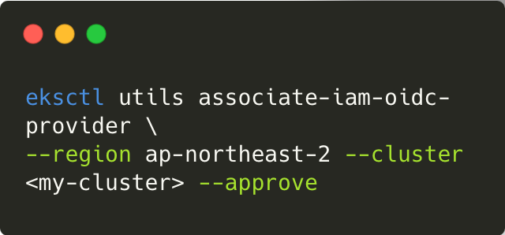
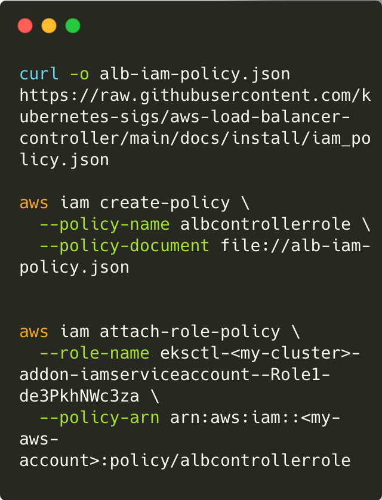
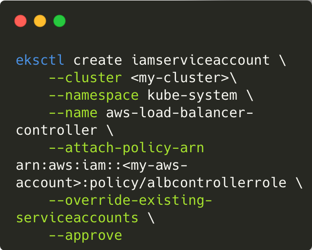
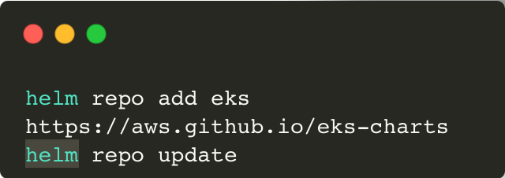
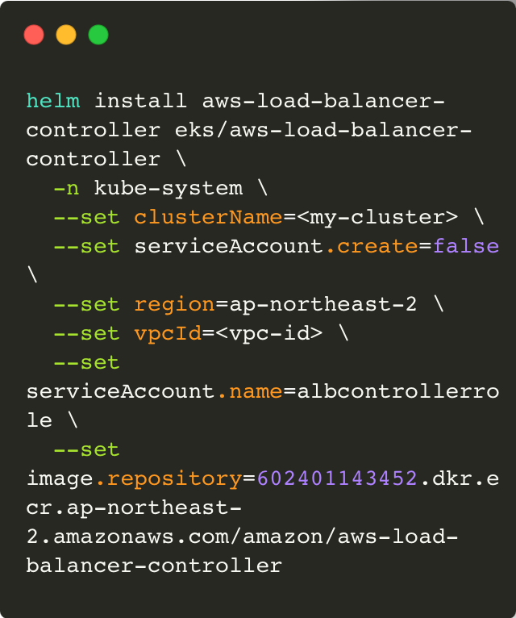
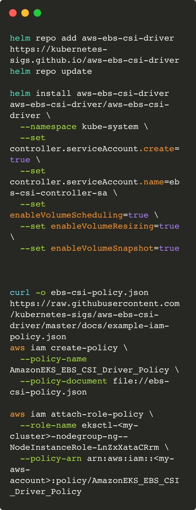

## How to configure EKS Controller

> EKS가 구성되어있다는 전제하에 진행하도록 하겠습니다.

IAM Role을 부여하기 위해서는 IAM OIDC Provider가 활성화되어 있어야 합니다. 여기서 말하는 '활성화'는 EKS 클러스터와 IAM OIDC Provider의 association을 의미합니다.
IAM OIDC Provider는 기본적으로 활성화되어 있지 않기 때문에 (default: not enabled) 하기 명령어를 이용하여 클러스터에 IAM OIDC provider를 associate 합니다. 

다음으로 사용자 대신 AWS API를 호출할 수 있는 AWS 로드 밸런서 컨트롤러의 IAM 정책을 다운로드한 후 해당 정책으로 iam 정책을 생성한뒤 해당 정책을 현재 사용중이던, IAM 역할에 부착합니다.

이후 생성한 역할을 통해 EKS Service Account 를 생성합니다. 
해당 Service Account 는 다음으로 설치할 AWS Account Controller에 연결할 역할입니다. 

eks-chart helm 리포지토리를 추가하여 helm 을 통해 aws-controller 를 설치 할 수 있도록 합니다.

이후 해당 차트가 적용되도록 로컬 리포지토리 또한 업데이트 합니다.

다음으로 helm 을 통해 AWS Loadbalancer Controller를 설치합니다.

EBS CSI Driver 또한 동일한 과정으로 Helm을 통해 설치한 후 해당 컨트롤러에서 사용되는 권한을 Node 가 사용하는 역할에도 부착 합니다.

또한 해당 Deployment가 사용하는 service Account의 경우 아래 명령어와 같이 Helm 차트를 사용하여 생성해주었습니다.

