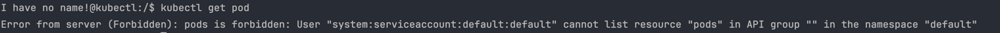
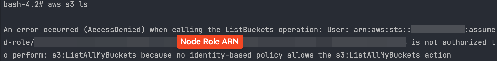
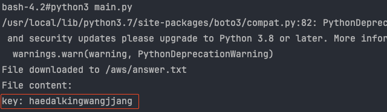
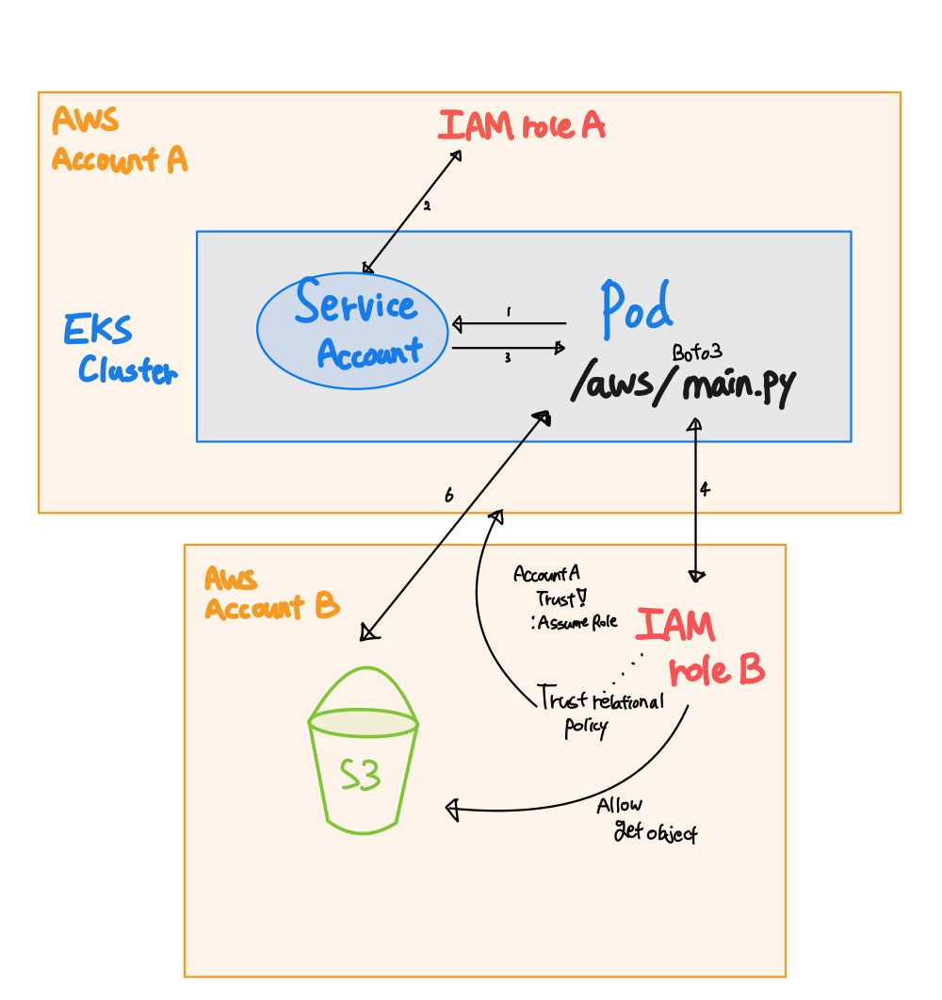

### 1️⃣ Pod 내부에서 kubectl 사용하기


#### 1.1 Pod 생성 및 오류 확인
먼저 파드를 생성합니다. 현재 생성된 파드에 대해 

먼저 아래 명령어를 통해 kubectl 이 설치되어있는 새로운 파드를 생성한 후 파드에 접속합니다. 

```shell
kubectl run kubectl --image bitnami/kubectl:latest --command -- sleep infinity
kubectl exec -it kubectl -- /bin/bash
```

파드 내부에서 아래 명령어를 실행시킬 경우 다음과 같은 에러 메세지를 확인 하실 수 있습니다.

```shell
kubectl get pod
```

<!--
해당 에러메세지의 경우 해당 파드가 생성되어있는 Default 네임스페이스의 Default Service Account 를 사용하며, 해당 Service Account에 Kubectl 명령을 통해 클러스터 내부 파드를 조회할 권한이 없다는 오류 입니다.

그렇기에 해당 파드에서 사용중인 Default Service Account에 이를 사용할 수 있는 권한 
-->
 
#### 1.2 role & role binding 생성

먼저 kubectl 을 사용할 수 있는 권한이 명시되어있는 role 을 생성합니다. 아래 yaml 파일을 적용하여, 이를 생성합니다.

```yaml
apiVersion: rbac.authorization.k8s.io/v1
kind: Role
metadata:
  name: kubectl-readonly
  namespace: default
rules:
  - apiGroups: [""]
    resources: ["pods", "services", "configmaps"]
    verbs: ["get", "list", "watch"]
```

생성한 role을 rolebinding 을 통해 현재 생성되어있는 service account 에 적용 해줍니다.

```yaml
apiVersion: rbac.authorization.k8s.io/v1
kind: RoleBinding
metadata:
  name: kubectl-readonly-binding
  namespace: default
subjects:
  - kind: ServiceAccount
    name: default
    namespace: default
roleRef:
  kind: Role
  name: kubectl-readonly
  apiGroup: rbac.authorization.k8s.io
```

이를 모두 생성한 후 다시 생성한 파드에 접근 하여 `kubectl get pod` 명령어를 사용 하면 정상적으로 현재 사용중인 클러스터의 파드 목록을 접근 합니다.

<hr/>


### 2️⃣ Pod 내부에서 AWS CLI 사용하기

#### 2.1 Pod 생성 및 오류 확인

아래 명령어를 통해 AWS CLI 가 설치되어있는 파드를 생성 후 해당 파드로 /bin/bash를 사용하여 접근합니다.

```bash
kubectl run awscli --image amazon/aws-cli:latest --command -- sleep infinity
kubectl exec -it awscli -- /bin/bash
```
파드에 접근 하여 `aws s3 ls` 명령어를 사용하게 된다면, 아래와 같은 오류가 발생됩니다.



#### 2.2 IAM Role 생성 및 Service Account 생성

AWS CLI 를 파드 내에서 사용 하기 위해선, 파드에 연결되어있는 서비스 어카운트, 혹은 워커 노드에서 사용되는 IAM 역할에 AWS CLI 에서 요구되는 권한을 위임하는 역할이 매핑 되어있어야 합니다.
먼저 AWS CLI 를 통해 로컬에서 IAM Role 생성을 진행 해보겠습니다.

```bash
cat <<EOF > s3-list-policy.json
{
    "Version": "2012-10-17",
    "Statement": [
        {
            "Effect": "Allow",
            "Action": [
                "s3:ListAllMyBuckets"
            ],
            "Resource": "*"
        }
    ]
}
EOF

# iam policy 생성
aws iam create-policy \
  --policy-name s3-list-only-policy \
  --policy-document file://s3-list-policy.json

# 생성한 iam policy 를 통해 service account 생성
eksctl create iamserviceaccount \
    --cluster codns-cluster \
    --namespace default \
    --name week4-sa \
    --attach-policy-arn arn:aws:iam::<aws-account>:policy/s3-list-only-policy \    
    --approve 
```

기존에 생성하였던 파드 이미지를 기반으로, pod를 구성하는 yaml 파일을 작성합니다.

```yaml
apiVersion: v1
kind: Pod
metadata:
  name: awscli
spec:
  automountServiceAccountToken: true
  serviceAccountName: week4-sa
  containers:
  - command:
    - sleep
    - infinity
    image: amazon/aws-cli:latest
    name: awscli
```

위 yaml 파일을 `kubectl apply -f <해당 파일 위치>` 를 통해 실행 시킨 후 파드 내부에 접근하여 `aws s3 ls` 명령어를 사용합니다.

### 3️⃣ Pod 내부에서 Cross Account 사용하여 타 계정의 리소스 접근하기

#### 3.1 문제상황 확인
위에서 연결 생성해두었던 `aws-cli` 파드에서 다른 AWS계정에 위치하고 있는 S3 버킷을 조회 하려고 합니다.

아무런 설정 없이 다른 파드에 접근 하려고 하면, 다음과 같은 오류가 발생합니다. 

```
bash-4.2# aws s3api get-object --bucket <bucket name> --key <file location> answer.txt 

An error occurred (AccessDenied) when calling the GetObject operation: Access Denied
```


먼저 대상 계정에 아래와 같은 작업이 이루어져야 합니다. 
- 접근하려는 대상 계정의 IAM Role 신뢰관계 정책이 현재 사용중인 AWS 계정에 대해 assume role 작업을 신뢰
- 대상 계정의 IAM Role이 S3 버킷을 조회하고 내부 파일에 접근할 수 있는 권한 부여

위 작업이 이루어져있다는 전제하에 진행 하겠습니다.
또한 Pod 내부에서 `aws configure`,`aws-cli profile` 을 사용하지 않고 이를 진행 해야 하기에, AWS Boto3를 활용하여 해보도록 하겠습니다.


#### 3.2 IAM 정책 추가, Python 파일 실행

Service Account 계정에 연결되어있는 IAM Role에 assume role 권한을 추가 합니다.
이전 단계에서 생성해둔 Service Account의 IAM Role에 정책을 수정 혹은 생성하여 아래 인라인 IAM 권한을 추가합니다. 

```JSON
{
    "Version": "2012-10-17",
    "Statement": [
        {
            "Sid": "Statement1",
            "Effect": "Allow",
            "Action": [
                "sts:AssumeRole"
            ],
            "Resource": [
                "*"
            ]
        }
    ]
}
```


이후 아래 링크의 boto3 코드를 Pod 내부에서 vi 명령어를 통해 생성합니다.

https://github.com/coodns/enhancement/blob/master/it_is_seaman_not_seman/k8s/week4/main.py

이후 해당 파이썬 파일을 실행시키기 위한 python3 와 boto3를 다운 받고 이를 실행 시킵니다.
```bash
yum install -y python3
pip3 install boto3
```
해당 파이썬 파일을 실행시킬 경우, 임의로 넣어두었던, S3 버킷 내 파일을 읽고 터미널에 출력해줍니다.



위 과정을 요약하면 아래와 같습니다.




### 4️⃣ Pod Identity Agent 사용하기

어떻게 해야하는지, Console 화면 캡처 해서 진행 

필요한 IAM Role 권한 + Service Account Dummy 사용 하고

