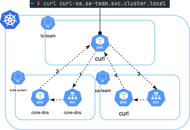
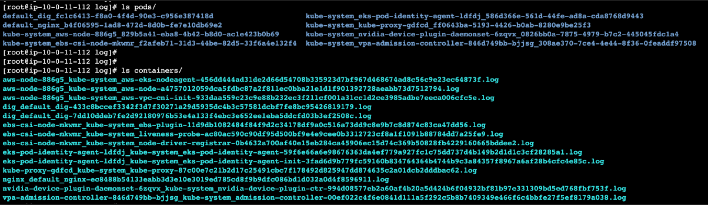
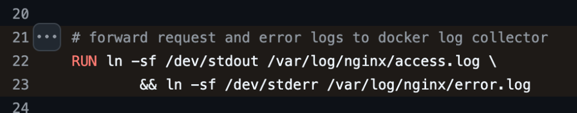

### CoreDNS란?

CoreDNS는 쿠버네티스 클러스터의 DNS 역할을 수행할 수 있는, 유연하고 확장 가능한 DNS 서버이며, 클러스터 내에서 주로 내부 도메인 쿼리, 외부 도메인 쿼리에 사용됩니다. 다른 애플리케이션과 마찬가지로 Pod로 호스팅 되며, Deployment 로 실행되어 Service로 요청을 받습니다.&#x20;

CoreDNS는 Kubernetes 클러스터에서 기본적으로 사용되는 DNS 서버입니다. 클러스터 내부에서 서비스 이름을 기반으로 통신할 수 있게 해주는 핵심 컴포넌트로, kube-dns를 대체하여 현재 대부분의 클러스터에서 기본 DNS 애드온으로 사용됩니다


**주요 기능:**

- 클러스터 내 Pod, Service 이름을 IP로 변환 (DNS name resolution)
- DNS 캐싱
- 플러그인 기반 구조로 확장성 뛰어남


### CoreDNS 애드온 설치 및 구성
- AWS 콘솔에서 작업,? 이걸 뭐 어캐 작성해야하나?

### 네임스페이스 생성

```bash
kubectl create namespace ts-team
kubectl create namespace sa-team
```

### curl 명령어가 가능한 Pod 배포

ts-team.yaml

```yaml
apiVersion: v1
kind: Pod
metadata:
  name: curl-ts
  namespace: ts-team
  labels:
    app: curl-ts
spec:
  containers:
    - name: curl
      image: curlimages/curl
      command: ["sleep", "3600"]
  restartPolicy: Never

```

sa-team.yaml

```yaml
apiVersion: v1
kind: Pod
metadata:
  name: curl-sa
  namespace: sa-team
  labels:
    app: curl-sa
spec:
  containers:
    - name: curl
      image: curlimages/curl
      command: ["sleep", "3600"]
  restartPolicy: Never
```

위 파일들을 각각 배포합니다.

```bash
# 네임스페이스 생성
kubectl create namespace ts-team
kubectl create namespace sa-team

# YAML 파일 적용
kubectl apply -f curl-ts.yaml
kubectl apply -f curl-sa.yaml
```

### 5. 각 파드에서 반대편 파드에 ping

```bash
kubectl exec -n ts-team curl-ts -- ping <curl-sa의 IP>
kubectl exec -n sa-team curl-sa -- ping <curl-ts의 IP>
```

### 6. IP 확인 방법

Pod의 IP는 다음 명령어로 확인할 수 있습니다:

```bash
kubectl get pod -o wide -n ts-team
kubectl get pod -o wide -n sa-team
```

각 명령어는 해당 네임스페이스 안의 Pod들의 내부 클러스터 IP를 보여줍니다.

### 7. curl을 통한 IP 없이 통신 시도

```bash
kubectl exec -n ts-team curl-ts -- curl curl-sa.sa-team.svc.cluster.local
kubectl exec -n sa-team curl-sa -- curl curl-ts.ts-team.svc.cluster.local
```

### 어떤 주소를 사용했는가?

Kubernetes DNS는 다음의 이름 구조를 가집니다:

```
<service-name>.<namespace>.svc.cluster.local
```

위 DNS 이름으로 Pod → Service 또는 Pod → Pod 통신이 가능합니다. 위 실습에서는 `curl-sa.sa-team.svc.cluster.local` 과 `curl-ts.ts-team.svc.cluster.local` 을 사용했습니다.

### 통신이 가능했던 이유

CoreDNS는 Kubernetes 내부의 DNS 요청을 처리하여, 위에서 언급한 도메인 형식으로 서비스 이름을 IP로 변환해줍니다. 따라서 실제 IP를 몰라도 해당 DNS 이름을 통해 다른 네임스페이스의 Pod나 Service에 접근할 수 있습니다.


### 같은 네임스페이스 vs 다른 네임스페이스 통신

| 통신 방식     | DNS 이름 예시                                                | 설명                          |
| --------- | -------------------------------------------------------- | --------------------------- |
| 같은 네임스페이스 | `curl-sa`                                                | 같은 네임스페이스일 경우 이름만 사용 가능     |
| 다른 네임스페이스 | `curl-sa.sa-team` 또는 `curl-sa.sa-team.svc.cluster.local` | 다른 네임스페이스는 반드시 전체 도메인 사용 필요 |

### 원리 정리 (Flowchart)

아래는 Pod가 DNS 이름을 사용해 통신할 때의 원리입니다:



이와 같은 원리로 CoreDNS가 클러스터 내의 통신을 가능하게 해줍니다.


---

### Pod의 로그

- Kubernetes 레벨
	Container 로그는 `kubectl logs` 명령을 통해 확인할 수 있습니다.

```bash
## Pod
# Container 1개
kubectl logs POD_NAME
# Container 2개 이상
kubectl logs POD_NAME CONTAINER_NAME
	
## labels
kubectl logs -l run=nginx
	
## Deploy
kubectl logs deploy/DEPLOY_NAME
	
```
```text
사용자 ──> kubectl logs my-pod
            │
            ▼
     [API Server]
            │
            ▼
   대상 Pod가 있는 노드의 [Kubelet]에 요청
            │
            ▼
   [Kubelet]이 로그 파일 확인 (/var/log/pods or container runtime)
            │
            ▼
   로그 내용을 API Server에 전달
            │
            ▼
        사용자에게 출력
```

### 컨테이너 로그의 저장 경로

- Node
	- `/var/log/pods/`
	- `/var/log/containers/`
  





- Container
	- stdout/stderr 로 보내서 노드에 로그를 저장할 수 있습니다.(런타임이 기록)
		- nginx, httpd 등은 access log와 error log를 `/dev/stdout` 또는 `/dev/stderr`로 심볼릭 링크 설정을 하여 로그를 내보냅니다.
			- 정확히는 `/dev/stdout` -> `/proc/self/fd/1` -> `pipe`
				
				[nginx 컨테이너 Dockerfile](https://github.com/nginx/docker-nginx/blob/8921999083def7ba43a06fabd5f80e4406651353/mainline/jessie/Dockerfile#L21-L23)
	- stdout/stderr을 이용하지 않는 컨테이너 내부의 로그는 별도 로직이 필요합니다.
		- OpenTelementry처럼 서버 내 애플리케이션에서 직접 로그를 보내도록 구성할 수 있습니다.


### 로그 중앙 집중화

로그 저장 방식에 따라 여러 오픈소스를 이용할 수 있습니다.

컨테이너에서 직접 로그를 가져오는 경우 사이드카 컨테이너를 통해 `/var/log/` 하위 등의 로그 파일을 가져오도록 구성하거나, DaemonSet을 통해 노드에 저장된 컨테이너 로그를 가져오도록 구성할 수 있습니다.

| 비교 항목 | 사이드카 방식 | DaemonSet 방식 |
| ---- | ---- | ---- |
| 배포 단위 | Pod 단위 | 노드 단위 |
| 리소스 오버헤드 | 높음 (Pod마다 Sidecar) | 낮음 |
| 멀티테넌시 격리 | 높음 (자기 Pod만 수집) | 낮음 (모든 Pod 로그 접근 가능) |
| 메타데이터 자동화 | 어렵거나 추가 설정 필요 | 쉬움 (노드 단위 메타데이터 가능) |
| 유연성 | Pod 단위로 세밀한 제어 가능 | 일반적 설정은 쉬움 |
| 사용 사례 | 보안이 중요한 워크로드, 커스텀 수집 필요 시 | 전체 클러스터 수집 |


로그 중앙 집중을 위한 대표적인 오픈소스는 아래와 같습니다.

|구분|오픈소스|배포 방식|설명|장점|단점|
|:---:|---|---|---|---|---|
|**1**|**Fluent Bit**|DaemonSet / 사이드카 둘 다 가능|경량 고성능 로그 수집기. 다양한 input/output 지원.|✅ 경량  <br>✅ 빠름  <br>✅ 다양한 목적지 지원|❗ 필터링/처리 로직은 Fluentd보다 제한적|
|**2**|**Fluentd**|DaemonSet / 사이드카 둘 다 가능|Ruby 기반 고성능 로그 파이프라인 처리기. 메타데이터 추출 우수.|✅ 유연한 플러그인 시스템  <br>✅ 메타데이터 지원 풍부|❗ 비교적 무거움  <br>❗ 복잡한 설정|
|**3**|**Filebeat**|DaemonSet / 사이드카 둘 다 가능|Elastic에서 만든 로그 수집기. Elastic Stack 연동에 최적화.|✅ ELK 연동 탁월  <br>✅ 안정성 높음|❗ Elastic 중심  <br>❗ 설정 구조 다소 복잡|
|**4**|**Vector**|DaemonSet / 사이드카 둘 다 가능|Datadog이 만든 Rust 기반 수집기. 성능, 유연성, UX 뛰어남.|✅ 고성능  <br>✅ 다양한 output  <br>✅ 멋진 config UX|❗ 최신 툴이라 커뮤니티/문서가 Fluent보단 작음|
|**5**|**Promtail**|**DaemonSet 전용**|Grafana Loki 전용 로그 수집기. 컨테이너 로그 → Loki 전송 특화.|✅ Loki에 최적화  <br>✅ Kubernetes 메타데이터 자동 태깅|❗ Loki 외 다른 output 없음|
|**6**|**Logagent**|DaemonSet / 사이드카 가능|Sematext 연동용. JSON 파싱 강점. Fluent보다 간단한 설정.|✅ 간단한 구성  <br>✅ 일부 SaaS 친화|❗ 상대적으로 사용자가 적음|
|**7**|**Custom Sidecar**|사이드카 전용|bash, busybox 등을 활용한 간단한 tail-forward 방식|✅ 매우 가볍고 유연  <br>✅ 특정 Pod용으로 간편|❗ 기능 제한 많음  <br>❗ 운영 복잡성 ↑|


## 로그 인덱스 형식 수정 방법