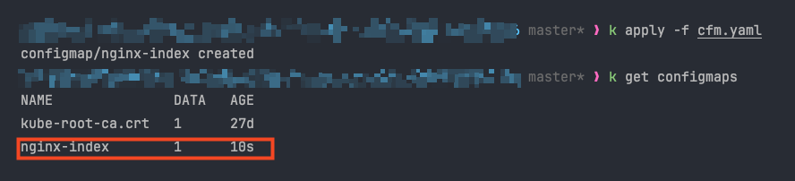

## 실행 중인 pod, node 의 지표 확인

Kubernetes에서는 기본적으로 `kubectl top` 명령어를 사용하여 CPU 및 메모리 사용량 지표를 확인할 수 있습니다.

- `kubectl top nodes`: **노드별 리소스 사용량**
- `kubectl top pod` : **파드 별 리소스 사용량**

해당 명령어 뒤에, 특정 노드 및 파드의 이름을 적게 된다면, 해당 파드 및 노드의 사용량만 확인 해볼 수 있습니다.

### 지표는 어떻게 가져오는가


> ***cAdvisor 란?***
>
> Kublet에 포함된 컨테이너 메트릭을 수집, 집계, 노출하는 데몬입니다.


## ConfigMap 실습
ConfigMap 과 Secret 을 적용시킬 Nginx Pod 를 구성하겠습니다.

pod.yaml
```yaml
apiVersion: v1
kind: Pod
metadata:
  name: nginx
  labels:
    app: nginx
spec:
  containers:
  - name: nginx
    image: nginx
```
ConfigMap의 경우  아래와 같은 yaml 파일 혹은 CLI 스크립트로 생성 할 수 있습니다.

아래 Yaml 파일을 작성한 후 생성해보겠습니다.

cfm.yaml
```yaml
apiVersion: v1
kind: ConfigMap
metadata:
  name: nginx-index
data:
  index.html: |
    hello onboarding
```


파드에 ConfigMap을 적용시키기 위해서, 다음과 같이 pod.yaml을 수정 하겠습니다.

pod.yaml
```yaml
apiVersion: v1
kind: Pod
metadata:
  name: nginx
  labels:
    app: nginx
spec:
  volumes:
  - name: html
    configMap:
      name: nginx-index
  containers:
  - name: nginx
    image: nginx
    volumeMounts:
    - name: html
      mountPath: /usr/share/nginx/html
```
해당 파일을 적용하여 ConfigMap 적용된 Pod를 생성해보겠습니다.


이후 해당 파드 내부에 접근하여, 마운트 위치(/usr/share/nginx/html) 위치에 configMap을 통해 생성한 파일이 존재하는지 확인 하며, 파일 내부 내용도 정상인지 확인합니다.


이후 해당 파드에서 실행중인 Nginx를 통해 접근 시 정상적으로 응답을 반환하는지 curl 명령어를 통해 확인합니다.


파드를 Ingress 를 노출 시키기 위해 Service 및 Ingress 를 생성해보겠습니다.

svc-ing.yaml
```yaml
apiVersion: v1
kind: Service
metadata:
  name: nginx-svc
  labels:
    app: nginx-svc
spec:
  type: ClusterIP
  ports:
  - port: 80
    targetPort: 80
    protocol: TCP
  selector:
     app: nginx

---

apiVersion: networking.k8s.io/v1
kind: Ingress
metadata:
  name: nginx-ingress
  annotations:
    alb.ingress.kubernetes.io/scheme: internet-facing
    alb.ingress.kubernetes.io/target-type: ip
    alb.ingress.kubernetes.io/listen-ports: '[{"HTTP": 80}]'
    alb.ingress.kubernetes.io/healthcheck-path: /
    alb.ingress.kubernetes.io/healthcheck-protocol: HTTP
spec:
  ingressClassName: alb
  rules:
  - http:
      paths:
      - path: /
        pathType: Prefix
        backend:
          service:
            name: nginx-svc
            port:
              number: 80
```

이후 생성된 Ingress 의 AWS ALB 엔드포인트를 통해 접속 시 정상적으로 접속이 되는지 확인 합니다.


## Secret 실습

ConfigMap 실습시 사용하였던 파드에 Secret 리소스 또한 부착해보겠습니다.


먼저 아래 Yaml 파일을 통해 Secret 리소스를 먼저 생성합니다.

sec.yaml
```yaml
apiVersion: v1
kind: Secret
metadata:
  name: nginx-secret
type: Opaque
stringData:
  username: onboarding
  password: welcome
```
> *Opaque* 란?
>
> 일반적인 용도의 시크릿으로써 ConfigMap과 동일한 목적으로도 사용할 수 있습니다.


이후 pod.yaml 파일을 아래와 같이 수정합니다. 이를 통해 컨테이너 내부의 환경변수로 이전에 생성하였던 Secret 값들이 적용됩니다.

configMap 과 secret을 모두 pod에 연결한 pod.yaml
```yaml
apiVersion: v1
kind: Pod
metadata:
  name: nginx
  labels:
    app: nginx
spec:
  volumes:
  - name: html
    configMap:
      name: nginx-index
  containers:
  - name: nginx
    image: nginx
    env:
      - name: USERNAME
        valueFrom:
          secretKeyRef:
            name: nginx-secret
            key: username
      - name: PASSWORD
        valueFrom:
          secretKeyRef:
            name: nginx-secret
            key: password
    volumeMounts:
    - name: html
      mountPath: /usr/share/nginx/html

```

#### Secret 으로 등록한 환경변수 확인 방법

```bash
kubectl exec -it nginx -- env | grep -E 'USERNAME|PASSWORD'
```

또는 printenv 명령을 사용할 수 있습니다
```bash
kubectl exec -it nginx -- printenv USERNAME \
kubectl exec -it nginx -- printenv PASSWORD
```


