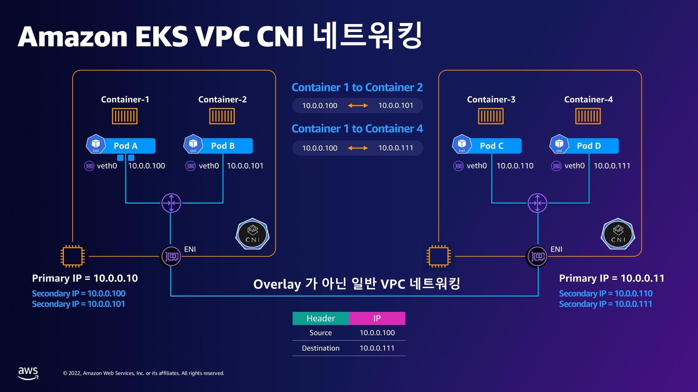

## ✅ Kubernetes에서 Pod 스케일링이 필요한 이유

Kubernetes는 트래픽 변화나 리소스 사용량에 따라 서비스의 안정성과 효율성을 위해 Pod 스케일링이 필요합니다.  
이는 자원을 자동으로 확장하거나 줄여서 유연하고 경제적인 운영을 가능하게 합니다.

---

## 🔄 스케일링의 종류

### 1. 수평 스케일링 (Horizontal Scaling)
- Pod 개수를 조절하여 확장
- 주로 Deployment, StatefulSet에서 사용
- HPA(Horizontal Pod Autoscaler)로 자동화 가능
- 메트릭 기반 (CPU, 메모리, 커스텀)

### 2. 수직 스케일링 (Vertical Scaling)
- Pod 하나의 리소스(CPU/Memory) 조절
- DaemonSet 등 Pod 수 조절이 어려운 경우 사용

---

## ⚙️ HPA 구성과 동작 방식

- **Metrics Server**가 필요함
- Ready 상태인 Pod만 기준으로 스케일링 결정
- 파라미터로 초기 상태 예외 처리 가능:
  - `--horizontal-pod-autoscaler-initial-readiness-delay`
  - `--horizontal-pod-autoscaler-cpu-initialization-period`

### 보수적 스케일링 처리
- 메트릭이 없거나 준비되지 않은 Pod는:
  - Scale Out 시: 0% 사용 → 확장 억제
  - Scale In 시: 100% 사용 → 축소 억제

---

## ⚠️ 스케일링 시 유의사항

- DaemonSet은 수평 스케일 불가 → 수직 스케일로 대응
- HPA는 Metrics Server 미설치 시 작동 불가
- 다음 Pod는 스케일 판단 제외됨:
  - 삭제 중(Pod deletionTimestamp 존재)
  - 실패한 Pod
  - Ready 상태가 아닌 Pod

---

## 🌐 Pod 네트워크 통신

- 동일 네임스페이스 내 Pod의 경우 **Service 이름 or Pod IP**를 통해 통신 할 수 있습니다.
- 다른 네임스페이스의 Pod와 통신할 경우에는 `service-name.namespace.svc.cluster.local` 형식을 사용합니다.

---

## 🌐 Ingress Controller란?

- 외부 HTTP(S) 트래픽을 클러스터 내부 서비스로 라우팅
- Ingress 리소스의 규칙을 기반으로 트래픽 전달
- 예: NGINX Ingress Controller, AWS ALB Controller 등

---

## 💊 Pod 헬스체크 구성

- `livenessProbe`: 살아있는지 확인 (실패 시 재시작)
- `readinessProbe`: 요청 수신 가능 여부 (실패 시 서비스 제외)
- `startupProbe`: 초기 구동 확인 (느린 앱 보호)

→ **readiness 실패 시** 트래픽 차단, **liveness 실패 시** 재시작

---

## 💾 Kubernetes Storage 기본 개념

### 관련 리소스
- **PersistentVolume (PV)**: 제공되는 볼륨
- **PersistentVolumeClaim (PVC)**: Pod가 요청하는 볼륨
- **StorageClass**: 볼륨의 동적 생성 정책 정의
#### StorageClass란?

- PVC 생성 시 어떤 스토리지 종류/성능을 사용할지 지정
- 동적으로 PV를 생성하며, 다양한 접근 모드 및 리소스 옵션 제공

---

## 📦 Deployment vs StatefulSet

| 항목             | Deployment (Stateless)        | StatefulSet (Stateful)                        |
|------------------|-------------------------------|-----------------------------------------------|
| 상태 저장 여부    | X                             | O                                             |
| Pod 정체성        | 동일함                           | 각 Pod에 고유한 이름/스토리지 부여                         |
| 주 사용 사례      | 웹 서버, API 서버 등 (상태 없는 애플리케이션) | DB, Kafka, Zookeeper 등 (순서, 고유성, 상태가 필요한 서비스) |

